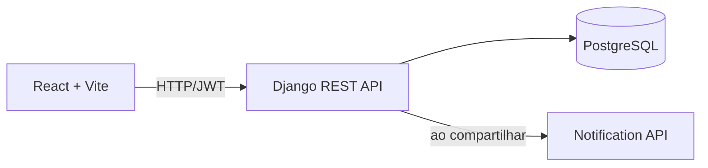

# Todo List

Aplicação web para gerenciamento de tarefas, desenvolvida para o teste prático de Desenvolvedor Python Back-end. Usuários autenticados podem organizar tarefas por categorias, filtrar e paginar a listagem e compartilhar tarefas com outras contas.

## Tecnologias

- Backend: Python, Django, Django REST Framework e PostgreSQL
- Frontend: React e Vite
- Autenticação: JWT (`djangorestframework-simplejwt`)
- Documentação: OpenAPI/Swagger (`drf-spectacular`)
- Testes: pytest/pytest-django e Selenium
- Infraestrutura: Docker e Docker Compose

## Arquitetura



O backend é dividido por domínio (`users`, `categories`, `tasks` e `notifications`). Cada app mantém modelos, serializers, views, permissões e serviços separados. A regra de acesso a tarefas compartilhadas fica em `apps/tasks/permissions.py`; o envio de notificações fica em `apps/notifications/services.py`.

## Decisões de design

- Uma tarefa pertence a um único proprietário e pode ser compartilhada com vários usuários.
- Quem recebe uma tarefa compartilhada pode apenas lê-la por padrão. O proprietário pode habilitar `can_edit` para permitir edição.
- A paginação usa `PageNumberPagination`, com dez itens por página: é simples de usar pela UI e adequada à listagem convencional de tarefas.
- A Notification API é um serviço separado e propositalmente pequeno. Ela valida e confirma o recebimento do evento; o backend principal registra o resultado da chamada para auditoria.
- O token JWT é persistido no navegador e incluído por interceptor Axios em cada requisição autenticada.

## Como executar

### Pré-requisitos

- Docker Desktop com Docker Compose v2

### Configuração

```bash
cp .env.example .env
docker compose up --build
```

Serviços disponíveis após a inicialização:

- Frontend: `http://localhost:5173`
- API: `http://localhost:8000/api/`
- Swagger: `http://localhost:8000/api/docs/`
- Notification API: `http://localhost:8001/health/`

Para remover os containers e o volume local do banco:

```bash
docker compose down -v
```

## Testes

Com os serviços locais instalados, execute:

```bash
# Backend
docker compose run --rm backend pytest

# API externa de notificações
docker compose run --rm notification-api pytest

# Frontend E2E (com a aplicação em execução)
cd frontend/tests/selenium
python -m pytest
```

Os testes Selenium usam `SELENIUM_BASE_URL` (padrão `http://localhost:5173`) e exigem Chrome/Chromium e ChromeDriver compatíveis.

## Endpoints principais

| Método | Endpoint | Descrição |
|---|---|---|
| POST | `/api/auth/register/` | Cria usuário |
| POST | `/api/auth/login/` | Retorna tokens JWT |
| POST | `/api/auth/refresh/` | Renova token de acesso |
| GET/POST | `/api/categories/` | Lista/cria categorias |
| GET/POST | `/api/tasks/` | Lista/cria tarefas |
| GET/PATCH/DELETE | `/api/tasks/{id}/` | Consulta, altera ou exclui tarefa |
| GET/POST | `/api/task-shares/` | Lista/cria compartilhamentos |
| GET | `/api/notifications/` | Lista notificações recebidas |

Filtros de tarefas: `status`, `category`, `title`, `start_date`, `end_date` e `page`. Exemplo: `/api/tasks/?status=false&title=relatório&page=2`.

O contrato completo está disponível no Swagger.
